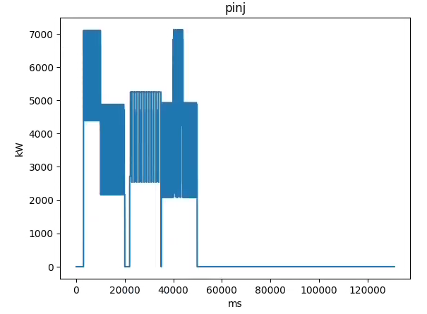

# D3D signals
Defines mapping of D3D MDS/PTdata signals to local storage on PU systems as yaml files

These definitions come in handy when workgin with D3D signals and provide 
* A handy way of accessing them, for example in a locally cached data file
* Quickly pulling data from MDS or PTDATA without having to remember where data is stored

## Installation and usage

This package is pip-installable. The workflow is to clone the git repository, activate your
virtual environment, and the install the package:

```bash
$ git clone git@github.com:PlasmaControl/d3d_signals.git
$ cd d3d_signals
$ source venv/bin/activate
(venv)$ pip install .
```

Here `source venv/bin/activate` activates a pip virtual environment as described in the
[python documentation](https://packaging.python.org/en/latest/guides/installing-using-pip-and-virtual-environments/). Other people may use conda instead.


If at any point the code was updated, pull the newest code and upgrade the package:
```bash
(venv)$ git pull
(venv)$ pip install --upgrade .
```


Now the data files in this package can be accessed using `resourcelib`:

```python
from os.path import join
import importlib.resources
import yaml
import d3d_signals

resource_path = importlib.resources.files("d3d_signals")

with open(join(resource_path, "signals_0d.yaml"), "r") as fp:
    signals_0d = yaml.safe_load(fp)

with open(join(resource_path, "signals_1d.yaml"), "r") as fp:
    signals_1d = yaml.safe_load(fp)


```


## Example uses


The signals used in the repository can be used like this:
```python
import importlib.resources
import yaml
import matplotlib.pyplot as plt
import MDSplus as mds

import d3d_signals

resource_path = importlib.resources.files("d3d_signals")

with open(join(resource_path, "signals_0d.yaml"), "r") as fp:
    signals_0d = yaml.safe_load(fp)

sig_pinj = signals_0d["pinj"]

c = mds.Connection("atlas.gat.com")
c.openTree(sig_pinj["tree"], 142111)

z = c.get(f"_s={sig_pinj['node']}").data()
z_units = c.get("units_of(dim_of(_s))")

x = c.get(sig_pinj['node']).dim_of().data()
x_units = c.get(f"""UNITS_OF({sig_pinj['node']})""").data()
plt.plot(x, z)
plt.xlabel(x_units)
plt.ylabel(z_units)
plt.title("pinj")
plt.savefig("pinj.png")
```




Similar for a profile:
```python
import importlib.resources
import yaml
import matplotlib.pyplot as plt
import MDSplus as mds

import d3d_signals

resource_path = importlib.resources.files("d3d_signals")

with open(join(resource_path, "signals_0d.yaml"), "r") as fp:
    signals_1d = yaml.safe_load(fp)


sig_ne = signals_1d["edensfit"]

c = mds.Connection("atlas.gat.com")
c.openTree(sig_ne["tree"], 142111)

zdata = c.get(f"_s={sig_ne['node']}").data()
zunits = c.get("units_of(_s)")

rank = zdata.ndim
# time-base
xdata = c.get("dim_of(_s)")
xunits = c.get("units_of(dim_of(_s))")
ydata = c.get("dim_of(_s, 1)")
yunits = c.get("units_of(dim_of(_s, 1))")
# space-base

#y = c.get(sig_ne['node']).data()
#y_units = c.get(f"""UNITS_OF({sig_ne['node']})""").data()
fig = plt.contourf(xdata, ydata, zdata)
plt.xlabel(xunits)
plt.ylabel(yunits)
plt.colorbar(label=zunits)
plt.title("edensfit (zipfit)")
plt.savefig("ne.png")
```


An example of how this mapping can be used in version-controlled datasets is 
here [dataset_d3d_100](https://github.com/PPPLDeepLearning/dataset_D3D_100).


The [d3d_loader](https://github.com/PlasmaControl/d3d_loaders/tree/main/d3d_loaders) repository
uses the signal nodes and `map_to` values to load the MDS signals in locally cached hdf5 files.

To create such a cache, use the `downloading.py` script provided in this repository.


